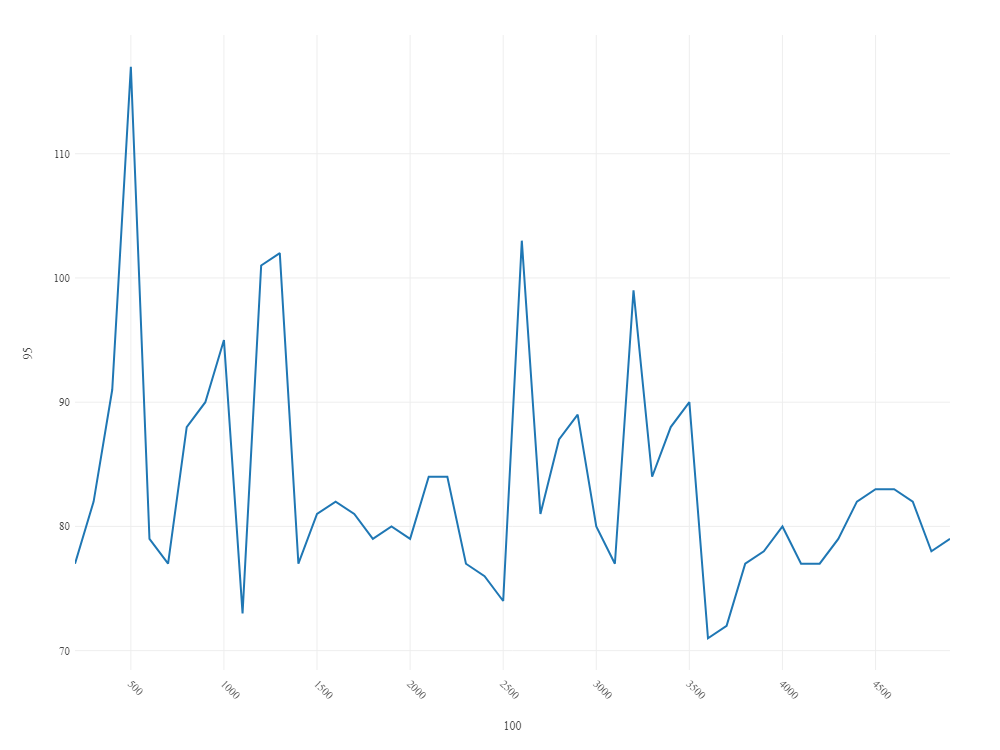
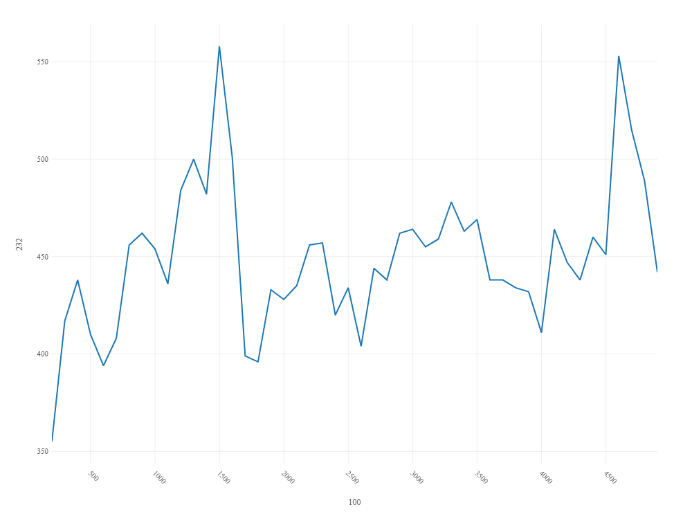
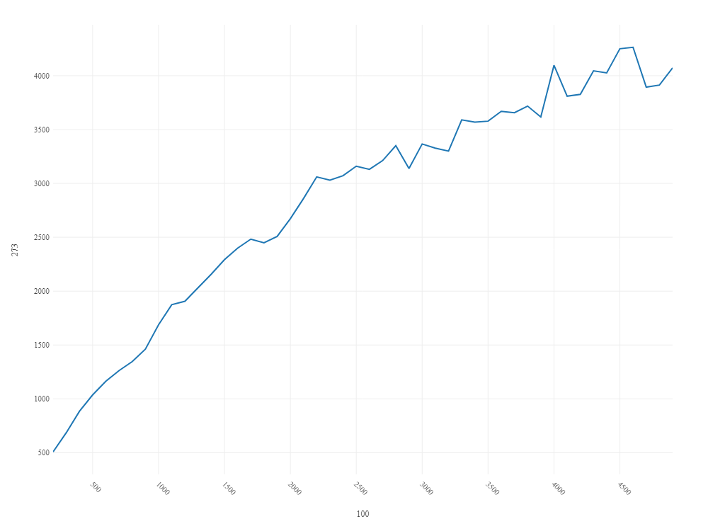
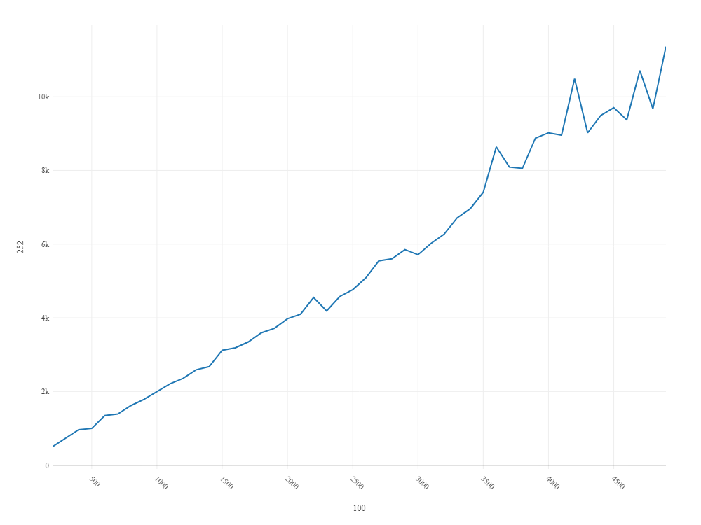

# Performance Analysis of Array Search

This document presents the performance analysis of searching for a random value inside array elements with varying integer distributions.

## Integer Distribution: (-10, 10)

The line chart below shows the relationship between array size and time taken to find a random value inside the array elements with an integer distribution between (-10, 10).

## Integer Distribution: (-100, 100)

The line chart below shows the relationship between array size and time taken to find a random value inside the array elements with an integer distribution between (-100, 100).

## Integer Distribution: (-1000, 1000)

The line chart below shows the relationship between array size and time taken to find a random value inside the array elements with an integer distribution between (-1000, 1000).

## Integer Distribution: (-10000, 10000)

The line chart below shows the relationship between array size and time taken to find a random value inside the array elements with an integer distribution between (-10000, 10000).

## Integer Distribution: (0, 5)

The line chart below shows the relationship between array size and time taken to find a random value inside the array elements with an integer distribution between (0, 5).

