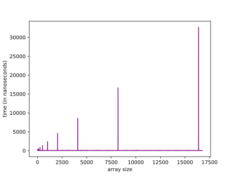
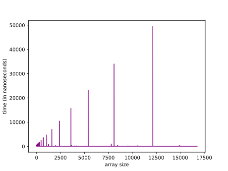
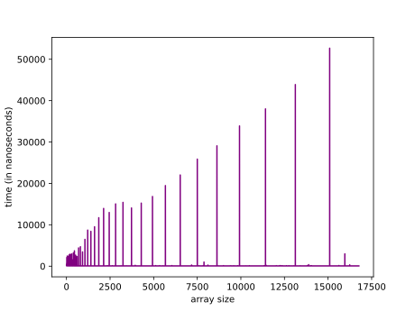

# PushBack Measurement

In this project, I measured the performance of different push_back methods for my Vector class. I tested the following methods:

- Method 1: push_back with a capacity increase of 2
- Method 2: push_back with a capacity increase of 1.5
- Method 3: push_back with a capacity increase of 1.15
- Method 4: push_back with a capacity increase of 100

## Results

The following graphs show the execution times for each push_back method with different array sizes:

As we can see from the graphs, Method 1 has the best performance in terms of execution time. This is because it increases the capacity of the vector by a large amount, which reduces the number of reallocations needed.

However, Method 1 also has the worst performance in terms of memory usage. This is because it allocates a large amount of memory upfront, even if it is not needed.

Method 3 has the best balance between execution time and memory usage. It increases the capacity of the vector by a small amount, which reduces the number of reallocations needed, but also does not allocate too much memory upfront.

Overall, I would prefer using Method 3 for push_back operations in C++. It provides a good balance between performance and memory usage.
