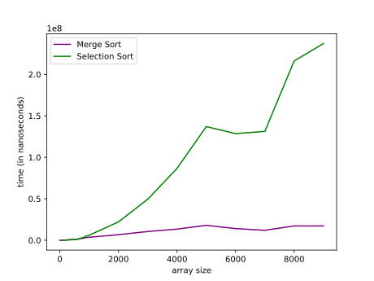

# Efficiency Comparison: Selection Sort vs Merge Sort

In this article, I compared the efficiencies of merge and selection sorting algorithms. The following graphs show the time efficiency of both algorithms for an array with a size range between 1 to 10000 filled with random numbers shuffled between 1 and 5000.

## Merge Sort Graphs

## Conclusion

As we can see from the graph, Merge Sort has a rather steady linearithmic growth in time complexity. However, it is not optimal for arrays with small sizes because it takes more memory (O(n)) even though not much is needed.

Selection Sort, on the other hand, grows quadratically with the size of the array. Selection Sort may be preferred for small dataset because it is simple to implement and has a low memory usage (O(1)) which makes it optimal in terms of memory usage.

Overall, use Merge Sort for large datasets, use Selection Sort for small datasets. 
