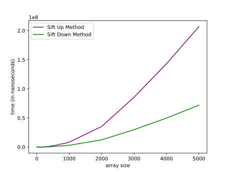

# Efficiency Comparison: Heap Sort Implementation Methods

In this article, I implemented Heap Sort Algorithm with two known subroutines, sift up and sift down. The following graphs show the time efficiency of both versions for an array with a size range between 1 to 5000 filled with random numbers shuffled between 1 and 5000.

## Sift Up and Sift Down Method Comparison Graph

## Conclusion

As shown in the above graphs, Method 1 (Sift Up) is a less efficient way of implementing Heap Sort, as the time needed to sort is almost doubled compared to Method 2 (Sift Down). The reason why this happens is because in the sift up method, we are essentially moving elements from the bottom of the heap to their correct positions, which can involve more swaps and hence more time complexity.

When it comes to choosing Heap Sort for your sorting algorithm, if you don't care about stability and want at least worst case O(nlogn) time complexity, then Heap Sort could be a good choice.