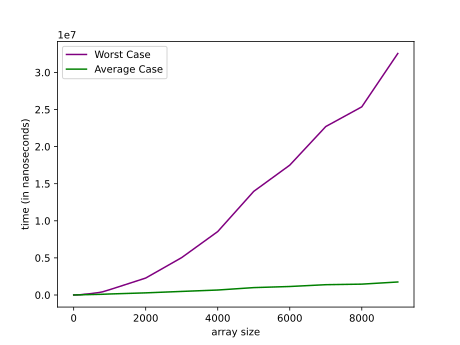

# Quick Sort Worst Case and Average Case Efficiency Comparison

In this article, I have implemented the Quick Sort Algorithm. The following graph show the time efficiency of Quick Sort in average case and worst case scenarios for given inputs. The array size ranges between 1 to 10000 and is filled with random numbers shuffled between 1 and 5000.

## Average and Worst Case Comparison

While the graph for worst case has plummeted, average case has a rather steady linear growth for time spent. This is because random numbers generated in the average case can be in a sorted (worst if pivot is the last) or reversed order that can cause these upsteady trend. To solve this problem with both graphs, it is recommended to find the pivot using the following strategy - Median of Three:

- Take The First Element
- Take The Last Element
- Take The Middle Element
- Sort The Elements
- Select The Element in the Middle as The Pivot

This way the chances of getting the worst case time efficiency decreases.

## Conclusion

In summary, the efficiency of the Quick Sort Algorithm is mainly related to the choice of pivot selection strategy. As I chose the strategy of First Element (Lomuto Partition Scheme) as Pivot, to avoid the worst case, I needed the the first generated number to be in the middle of the range 1-5000 so that there is a balance. The same goes for Pivot as the Last Element. However, In practice, Quick Sort proved to be the fastest sorting algorithm, outputting the results quickly, as the name suggests :). However, due to the risk of encountering the worst-case scenario, I would not prefer to use Quick Sort Algorithm.
