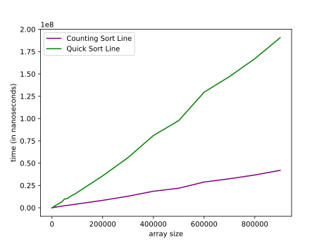

# Comparison of Counting Sort and Quick Sort Algorithm
In this article, I have implemented the Counting Sort Algorithm. The following graph show the time efficiency of Counting Sort compared to Quick Sort where I implemented in the previous class. The array size ranges between 1 to 1'000'000 and is filled with random numbers shuffled between 1 and 10.

## Counting Sort and Quick Sort Graph

## Conclusion

As shown in the graph, Counting sort is very optimal algorithm if we use it for:
- Sorting integer arrays
- Sorting arrays where the range of elements is not too large.

Given that both conditions above are satisfied for an array with numbers between 0-10, Counting Sort Algorithm outperformed Quick Sort, even any sorting algorithm we could compare.

As per Quick Sort, it could be effective for large dataset of values. In this example the range is so small and even though pivot is most likely always optimal, the time spent for partitioning makes it less efficient  than Counting Sort.